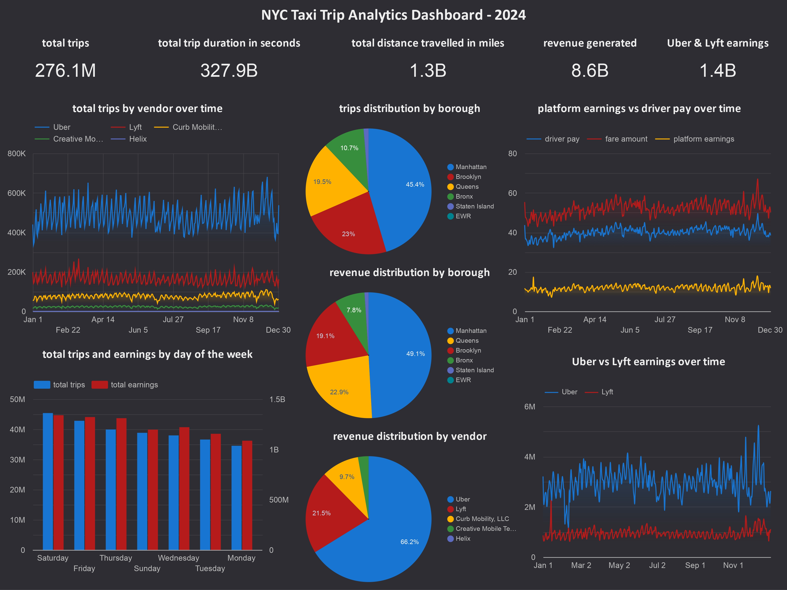

# 🗽 NYC Trips Analytics

Every day, thousands of taxi rides crisscross New York City, generating a massive trail of untapped data. This project analyzes taxi trip data from 2024 to uncover how ride patterns shift across boroughs, how earnings are split between drivers and platforms, and how rider behavior changes over time. It helps answer key questions like:

- Which vendors have the highest trip volume growth over time?
- How does rider demand vary by weekday?
- Which boroughs generate the most trips and earnings?
- How much of each fare goes to drivers vs platforms?

## ⚙️ Tools Used

| Layer            | Technology     |
|------------------|----------------|
| Storage          | Google Cloud Storage (GCS) |
| Data Warehouse   | BigQuery       |
| Transformation   | DBT            |
| Visualization    | Looker Studio  |

## 🏗️ Data Architecture

This project follows the **Medallion Architecture** (Bronze → Silver → Gold) for building a scalable and maintainable data pipeline, and uses the **Star Schema** design pattern in the Gold layer for analytics.

1. **Bronze Layer – Raw Ingestion**  
   2024 NYC taxi trip datasets (Yellow, Green, FHV, HVFHV) are manually downloaded and stored in **Google Cloud Storage (GCS)**. External tables are defined in **BigQuery** to reference the raw CSVs without immediate data loading.

2. **Silver Layer – Cleansed and Enriched**  
   Using **DBT**, raw data is transformed into clean, structured models. This includes:  
   - Adding calculated fields (trip duration, fare breakdown)
   - Adding data quality flags

3. **Gold Layer – Aggregated Business Views**  
   Final DBT models are organized using a **Star Schema**, with:  
   - A central **fact table** for trips and earnings  
   - **Dimension tables** for date, location, payment, ratecode and vendor 


4. **Visualization**  
   The Gold layer is connected to **Looker Studio** to visualize: 
   - Trends in trip volume and earnings  
   - Weekly rider behavior  
   - Vendor performance over time  
   - Borough-level distributions
   - **See the live dashboard here:** [NYC Taxi Analytics Dashboard](https://lookerstudio.google.com/reporting/d090cdc0-a978-4b92-b1bd-50221e595cfb)


## 🛠️ How to Run

### 1. 📥 Download the 2024 NYC Taxi Dataset

Download the NYC taxi trip data for 2024 from the official NYC Taxi & Limousine Commission data repository:

- [NYC TLC Trip Record Data](https://www1.nyc.gov/site/tlc/about/tlc-trip-record-data.page)

Make sure to download the relevant files for:
- Yellow Taxi
- Green Taxi
- For-Hire Vehicles (FHV)
- High Volume For-Hire Vehicles (HVFHV)
- Taxi zone lookup table

### 2. ☁️ Upload to Cloud Storage

Create a bucket in your preferred cloud provider (e.g., Google Cloud Storage), and upload all the downloaded parquet and csv files.

### 3. 🏗️ Create External Tables in BigQuery

Use the provided SQL scripts in the `scripts/` folder to create external tables in your preferred data warehouse (e.g., BigQuery).

For BigQuery:
- Update the bucket URI in each script to match your uploaded paths.
- Run the SQL scripts to create external tables pointing to the files in your cloud storage bucket.

### 4. 🚀 Run DBT Models

Use [DBT Cloud](https://www.getdbt.com/) or the CLI to build your dbt models.

Steps:
- Clone this repository locally or link it directly to your dbt cloud account.
- Set up your dbt profile with your warehouse credentials.
- Run the following DBT commands:

```
dbt seed       
dbt build --select bronze
dbt build --select silver
dbt build --select gold      
```
This builds a layered data model including raw (bronze), cleaned (silver), and aggregated (gold) tables and views.

### 5. 📊 Create Dashboards in Looker Studio

Use [Looker Studio](https://lookerstudio.google.com/) to visualize insights from your gold tables.

Steps:
- Open Looker Studio and create a new report.
- Add BigQuery as a data source and connect to your gold layer views.
- Build charts, tables, and filters to create interactive dashboards for trip trends, fare analysis, peak hours, and more.

## 🔮 What's next?

To further improve and expand this project, consider the following next steps:
- **Automate Data Ingestion**  
  Set up scheduled pipelines to automatically ingest new NYC taxi data monthly or quarterly.

- **Expand Data Coverage**  
  Include additional years or other related datasets like traffic or weather data for richer analysis.

- **Add More BI Dashboards**  
  Build dashboards focusing on driver performance, rider demographics, or detailed zone-level trends.

- **Forecasting Models**  
  Build time-series models to predict future trip volumes or demand by zone.

Feel free to fork the repo, explore new metrics, or extend the pipeline to suit your use case!
